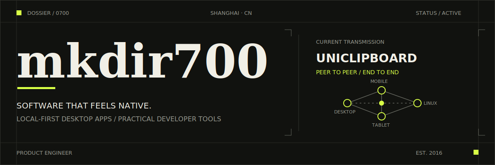
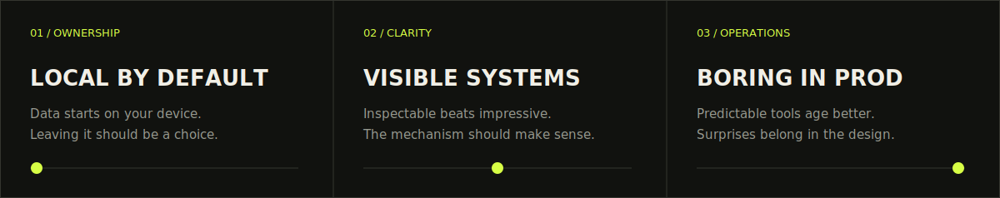

  <picture>
    <source media="(max-width: 600px)" srcset="./assets/profile-header-mobile.svg" />
    
  </picture>

  <a href="https://www.z2blog.com/">Journal</a>
  &nbsp;&nbsp;/&nbsp;&nbsp;
  <a href="mailto:mkdir700@gmail.com">Email</a>
  &nbsp;&nbsp;/&nbsp;&nbsp;
  <a href="https://x.com/mkdir700">X</a>

  <strong>I build software that feels native, stays understandable, and keeps your data yours.</strong> 
  Rust · Python · TypeScript · Neovim · Shanghai

 

01 / CURRENT BUILD

## The clipboard should be a capability, not a cloud service.

[**UniClipboard**](https://github.com/UniClipboard/UniClipboard) keeps copy and paste in sync across your devices while the data stays under your control.

<table>
  <tr>
    <td width="33%" valign="top">
      <strong>LOCAL BY DEFAULT</strong> 
      No account and no central server between your devices.
    </td>
    <td width="33%" valign="top">
      <strong>PRIVATE IN TRANSIT</strong> 
      Peer-to-peer transport with end-to-end encryption.
    </td>
    <td width="34%" valign="top">
      <strong>ONE CLIPBOARD</strong> 
      Windows, macOS, Linux, iOS, and Android.
    </td>
  </tr>
</table>

[Website](https://uniclipboard.app) &nbsp;·&nbsp; [Source](https://github.com/UniClipboard/UniClipboard) &nbsp;·&nbsp; [Releases](https://github.com/UniClipboard/UniClipboard/releases) &nbsp;·&nbsp; `Rust` `Tauri` `React`

 

02 / SELECTED SYSTEMS

## Useful software, built around a clear job.

<table>
  <tr>
    <td width="50%" valign="top">
      
        
      02A / LANGUAGE LEARNING
      <h3><a href="https://github.com/mkdir700/EchoPlayer">EchoPlayer ↗</a></h3>
      
Turns real movies and shows into sentence-by-sentence listening practice, with the player doing the tedious work.

      
<a href="https://www.echoplayer.cc">Website</a> &nbsp;·&nbsp; <code>TypeScript</code> <code>Electron</code> <code>React</code>

    </td>
    <td width="50%" valign="top">
      
        
      02B / OPEN INFRASTRUCTURE
      <h3><a href="https://github.com/ChainBuff/open-sol-bot">OpenSolBot ↗</a></h3>
      
An open-source Telegram trading bot for Solana: copy trading, wallet monitoring, and deployment under your control.

      
<a href="https://github.com/ChainBuff/open-sol-bot/wiki/Deployment">Deploy</a> &nbsp;·&nbsp; <code>Python</code> <code>Solana</code> <code>Docker</code>

    </td>
  </tr>
</table>

 

03 / HOW I BUILD

## A few constraints make better tools.

  <picture>
    <source media="(max-width: 600px)" srcset="./assets/build-principles-mobile.svg" />
    
  </picture>

 

04 / TOOLBOX

## The tools change. The criteria do not.

<table>
  <tr>
    <td><strong>CORE</strong></td>
    <td><code>Rust</code> &nbsp; <code>Python</code> &nbsp; <code>TypeScript</code> &nbsp; <code>Lua</code> &nbsp; <code>Go</code></td>
  </tr>
  <tr>
    <td><strong>PRODUCT</strong></td>
    <td><code>Tauri</code> &nbsp; <code>React</code> &nbsp; <code>Next.js</code> &nbsp; <code>Electron</code></td>
  </tr>
  <tr>
    <td><strong>SYSTEMS</strong></td>
    <td><code>SQLite</code> &nbsp; <code>Docker</code> &nbsp; <code>Cloudflare</code> &nbsp; <code>Linux</code></td>
  </tr>
  <tr>
    <td><strong>WORKBENCH</strong></td>
    <td><code>Neovim</code> &nbsp; <code>Git</code> &nbsp; <code>Shell</code></td>
  </tr>
</table>

I reach for tools that are fast, inspectable, and boring in production. Vim permanently changed what I expect from an editor.

 

05 / SIGNAL

## Work leaves a trace.

<picture>
  <source media="(prefers-color-scheme: dark)" srcset="https://raw.githubusercontent.com/mkdir700/mkdir700/output/github-snake-dark.svg" />
  <source media="(prefers-color-scheme: light)" srcset="https://raw.githubusercontent.com/mkdir700/mkdir700/output/github-snake.svg" />
  
</picture>

  
<strong>Weekly coding activity</strong>

   
  

    <picture>
      <source media="(prefers-color-scheme: dark)" srcset="https://wakatime.com/share/@50ffbbac-c6c1-49c8-8949-00372b6872ed/ecdcacf4-be46-43ff-9da5-4dcf1e218d2d.svg" />
      <source media="(prefers-color-scheme: light)" srcset="https://wakatime.com/share/@50ffbbac-c6c1-49c8-8949-00372b6872ed/40f088e6-5fe3-48e6-bfcc-1fd7c69f5e19.svg" />
      
    </picture>
    <picture>
      <source media="(prefers-color-scheme: dark)" srcset="https://wakatime.com/share/@50ffbbac-c6c1-49c8-8949-00372b6872ed/11e83183-5ddc-4b88-ac16-715d5556681e.svg" />
      <source media="(prefers-color-scheme: light)" srcset="https://wakatime.com/share/@50ffbbac-c6c1-49c8-8949-00372b6872ed/11c79fd9-e09b-44c7-8c31-06469a85d82a.svg" />
      
    </picture>
  

 

---

  OPEN TO THOUGHTFUL CONVERSATIONS ABOUT 
  <strong>desktop software · local-first systems · useful developer tools</strong>  
  <a href="mailto:mkdir700@gmail.com">mkdir700@gmail.com</a>

